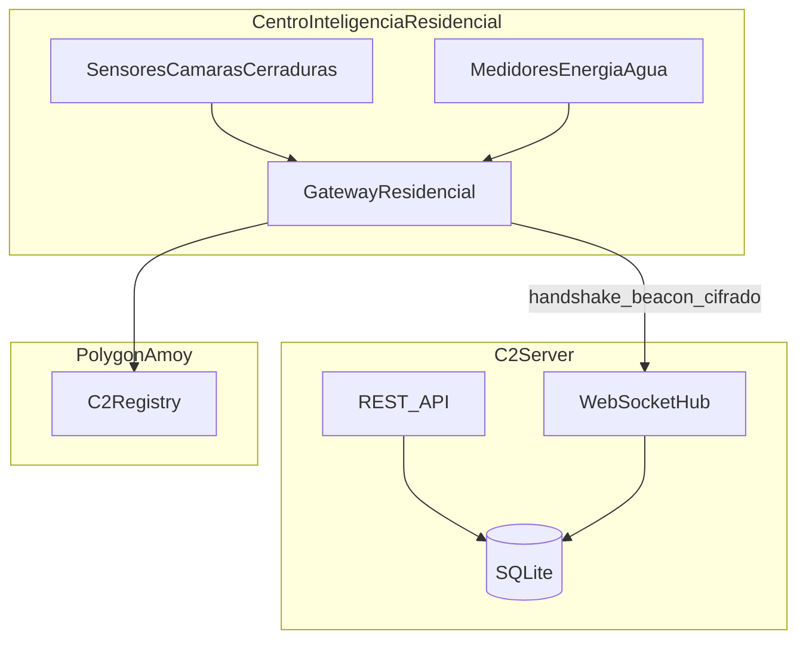
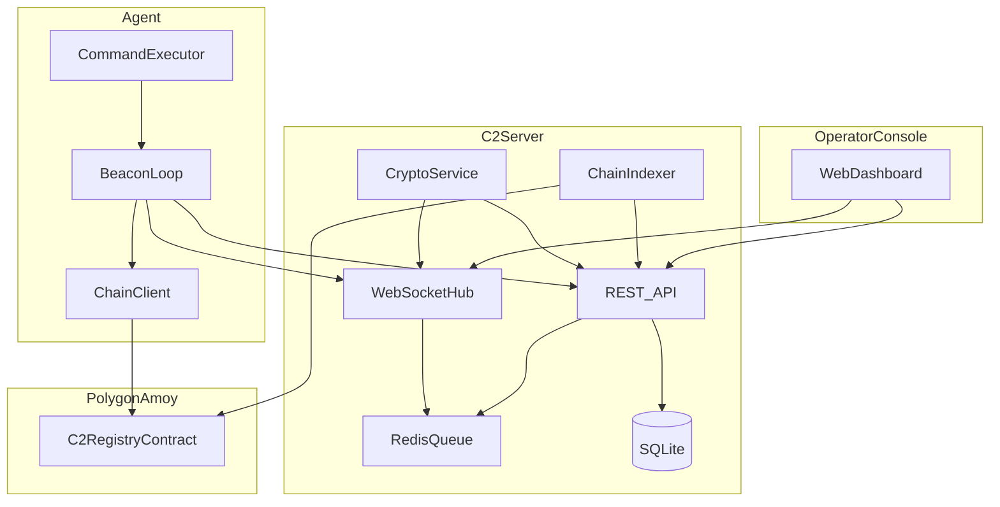
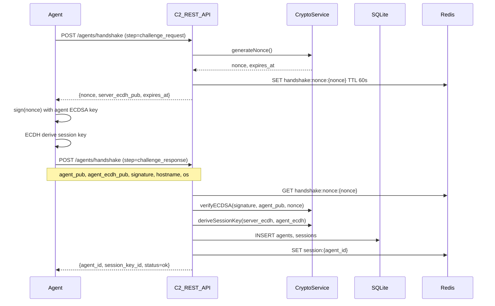
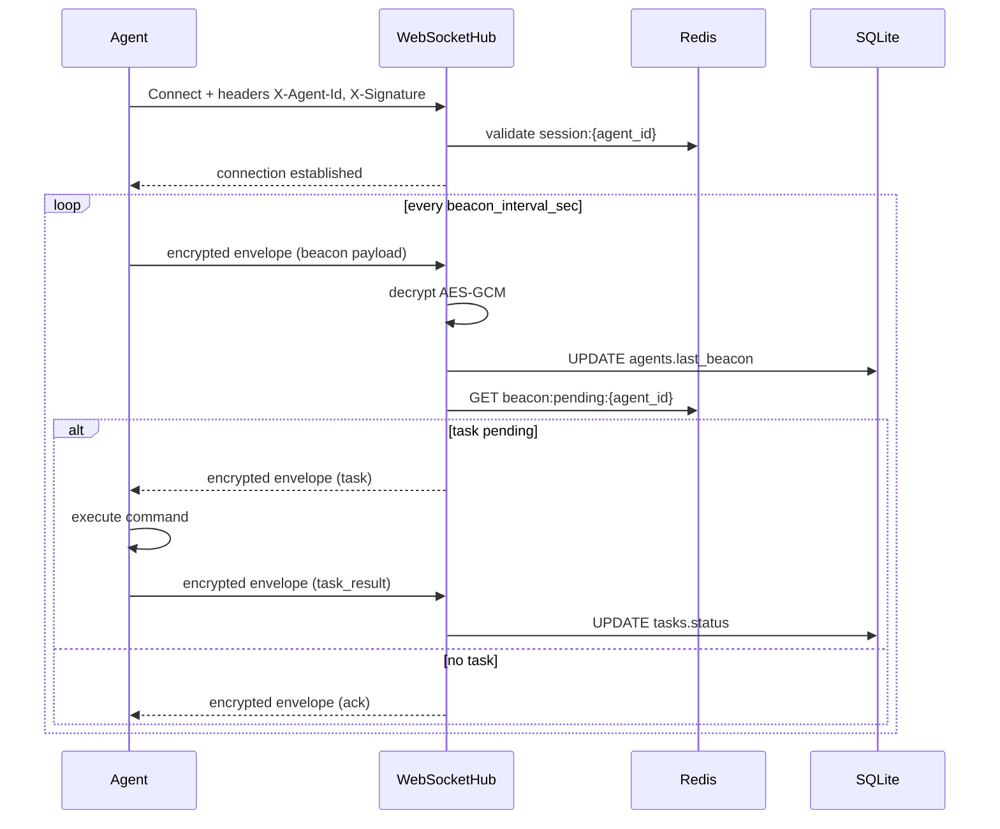
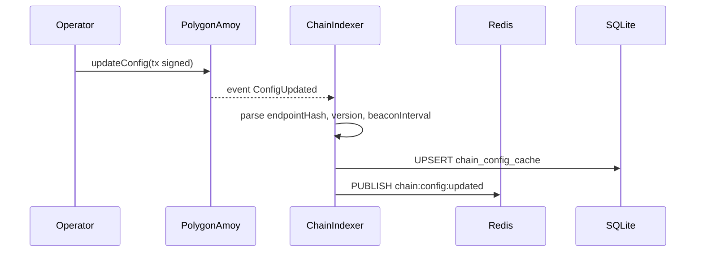
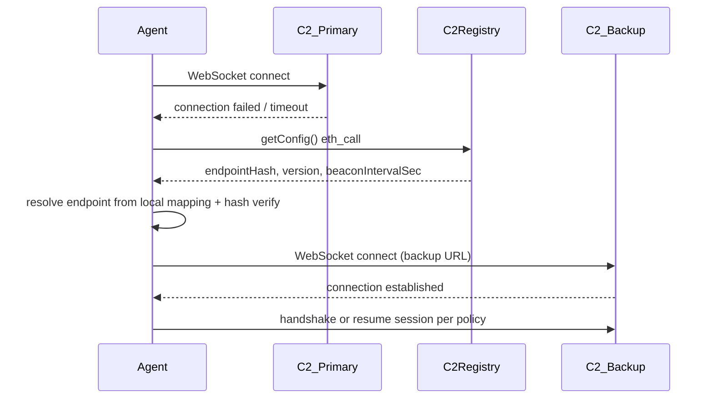

# 02 — System Architecture

## Resumen

El sistema consta de cuatro dominios principales: **Operator Console**, **C2 Server**, **Agent** y **Polygon Amoy** (contrato `C2Registry`). La comunicación operativa (handshake, beacon, tareas) usa REST/WebSocket con payloads cifrados. La blockchain provee registro verificable de configuración y operadores autorizados.

## Alineación con la curva de complejidad Aligo

El reto define una curva desde un C2 básico tipo `netcat + shell` hasta arquitecturas originales con tecnologías externas. Esta propuesta apunta al **Nivel 4 — Aligo**, sin perder el mínimo funcional exigido.

| Nivel del reto | Requisito | Cobertura en esta arquitectura |
|----------------|-----------|--------------------------------|
| Nivel 1 — básico | Servidor recibe conexión de un agente y ejecuta comandos remotos | `C2 Server` + `Agent` + task `whoami` |
| Nivel 2 — intermedio | Protocolo propio, cifrado y manejo de varios agentes | REST/WebSocket, AES-256-GCM, `agents`, `sessions`, `tasks` |
| Nivel 3 — avanzado | Arquitectura distribuida, resiliente, reconexión automática y cifrado robusto | Redis queue, failover, chain indexer, anti-replay, TLS |
| Nivel 4 — Aligo | Integración original con otras tecnologías | Polygon Amoy + `C2Registry` para confianza, autorización y configuración verificable |

La blockchain se usa como **mecanismo de coordinación y confianza**, no como transporte de comandos. Esta decisión mantiene la demostración rápida y funcional, mientras agrega innovación técnica evaluable.

## Desarrollo propio vs frameworks (Metasploit y similares)

El reto permite Linux y Windows como hosts del agente y el uso de frameworks ofensivos en lab, pero **exige un C2 construido por el equipo**.

```text
┌─────────────────────────────────────────────────────────────┐
│  DESARROLLO PROPIO (obligatorio — núcleo evaluable)        │
│  C2 Server │ Protocolo │ Agente │ C2Registry │ Operator API │
├─────────────────────────────────────────────────────────────┤
│  COMPLEMENTO OPCIONAL (lab)                                 │
│  Metasploit módulos │ scripts post-exploit │ payloads de prueba│
└─────────────────────────────────────────────────────────────┘
```

| Componente | Origen | Notas |
|------------|--------|-------|
| `cmd/server` | Equipo | Orquestación, sesiones, tareas, indexer |
| `cmd/agent` | Equipo | Beacon, handshake, executor; Linux + Windows |
| REST/WebSocket + envelopes | Equipo | Protocolo documentado en `03_api_design.md` |
| `C2Registry.sol` | Equipo | Registry on-chain |
| Metasploit | Externo (opcional) | Tarea `command_type: msf_module` que invoca módulo en VM; el **canal C2 sigue siendo el propio** |

**Anti-patrón (no entregar)**: listener Metasploit + implant MSF sin servidor/protocolo propio = no es el C2 del reto.

## Camuflaje e innovación (recomendación retadores)

Los retadores piden **innovación** (no réplicas de C2 conocidos) y operación **realista** en lab (“que no los pillen” en inspección superficial). Estrategia documentada:

```text
┌──────────────────────────────────────────────────────────┐
│  Vista externa (SOC lab / logs)                          │
│  API IoT legítima · TLS · JSON con blobs cifrados        │
├──────────────────────────────────────────────────────────┤
│  Vista real (operador autorizado)                        │
│  C2 propio · comandos shell/IoT · cerraduras simuladas   │
├──────────────────────────────────────────────────────────┤
│  Metadata sensible                                       │
│  Polygon Amoy · endpointHash · identidades · sin URLs    │
└──────────────────────────────────────────────────────────┘
```

| Mecanismo | Componente | Detalle |
|-----------|------------|---------|
| Camuflaje de tráfico | `internal/api`, agente | Paths `/api/v1`, headers IoT, User-Agent configurable |
| Cifrado opaco | `internal/crypto` | Envelopes AES-GCM; sin comandos en claro |
| Beacon jitter | Agente + config on-chain | `beaconIntervalSec ± jitter%` |
| Blockchain stealth | `C2Registry`, `internal/chain` | Config e identidades; comandos **nunca** on-chain |
| Escenario realista | Gateway + simuladores | Sensores simulados, lock/unlock, telemetría |

Detalle completo: [05_security_specs.md](./05_security_specs.md) (sección Camuflaje operativo).

## Capa IoT — Centro de Inteligencia Residencial

La fusión con el ecosistema residencial modela **gateways** como agentes C2 y dispositivos (sensores, cámaras, cerraduras, medidores) como fuentes de eventos y telemetría cifrada.



| Dispositivo | Patrón C2 | Mensaje típico |
|-------------|-----------|----------------|
| Gateway | Agente principal | `beacon`, handshake, entrega de tareas IoT |
| Sensor / cámara / cerradura | Evento vía gateway | `iot_event` cifrado |
| Medidor energía/agua | Telemetría vía gateway | `iot_telemetry` cifrado |

Detalle de implementación paso a paso: [07_iot_residential_fusion.md](./07_iot_residential_fusion.md).

## Diagrama de componentes



## Despliegue

### Docker Compose (lab local)

```text
ingeleanh/c2-blockchain/
├── docker-compose.yml          # Fase 2
├── cmd/server/
├── cmd/agent/
└── ...
```

Servicios previstos:

| Servicio | Imagen / build | Puerto | Función |
|----------|----------------|--------|---------|
| `c2-server` | build `cmd/server` | 8443 (TLS) | API REST + WebSocket |
| `redis` | redis:7-alpine | 6379 | Sesiones, queue, rate limit |
| `hardhat` (opcional) | node + hardhat | 8545 | Chain local para dev sin Amoy |

SQLite corre como archivo en volumen del server (`/data/c2.db`). Los agentes se despliegan en **VMs lab separadas** — Linux o Windows según el escenario de demostración.

### Agentes por sistema operativo

| SO | Build target (Go) | Comando demo típico | Notas |
|----|-------------------|---------------------|-------|
| Linux | `GOOS=linux GOARCH=amd64` | `whoami`, `id` | MVP principal en hackathon |
| Windows | `GOOS=windows GOARCH=amd64` | `whoami` (cmd) | VM Windows del lab autorizado |
| Gateway IoT (Linux) | `linux-amd64` / `arm64` | telemetría simulada | Opcional fusión residencial |

Cross-compile desde el mismo módulo Go; el campo `os` en handshake identifica la plataforma (`linux-amd64`, `windows-amd64`).

### Topología de red lab

```text
┌─────────────────────────────────────────────────────────┐
│  VLAN Lab (aislada)                                     │
│  ┌──────────────┐    TLS     ┌──────────────┐          │
│  │  C2 Server   │◄──────────►│ Agent VM     │          │
│  │  + Redis     │            │ Linux/Windows│          │
│  └──────┬───────┘            └──────┬───────┘          │
│         │                           │                 │
│         └───────────┬───────────────┘                 │
│                     │ HTTPS RPC                       │
│                     ▼                                 │
│              Polygon Amoy (testnet)                 │
└─────────────────────────────────────────────────────────┘
```

## Módulos futuros (Fase 2 — sin código en Fase 1)

```text
ingeleanh/c2-blockchain/
├── cmd/
│   ├── server/          # Entrypoint C2 server (Linux)
│   └── agent/           # Entrypoint agente (Linux + Windows)
├── internal/
│   ├── api/             # Handlers REST + WS
│   ├── crypto/          # AES-GCM, ECDSA, HKDF
│   ├── handshake/       # Challenge-response
│   ├── chain/           # go-ethereum client, indexer
│   ├── store/           # SQLite + Redis adapters
│   ├── tasks/           # Task queue y ejecución
│   ├── executor/        # shell (OS-aware), iot_command, opcional msf bridge
│   ├── sim/             # Sensores y cerraduras simulados (lab)
│   └── camouflage/      # Jitter beacon, headers IoT, sanitización logs
├── contracts/
│   └── C2Registry.sol   # Smart contract
└── tests/
    ├── integration/
    └── e2e/
```

## Flujo de datos — Handshake

El handshake establece identidad del agente (ECDSA), deriva clave de sesión (ECDH + HKDF) y registra el agente en SQLite.



### Pasos detallados

1. **Challenge request**: Agente solicita nonce. Servidor genera nonce 32 bytes (hex), clave ECDH temporal del servidor, `expires_at` (+60s).
2. **Challenge response**: Agente envía clave pública ECDSA (secp256k1), clave ECDH P-256, firma ECDSA del nonce, metadata (`hostname`, `os`).
3. **Verificación**: Servidor valida nonce no reutilizado, firma dentro de ventana ±30s, ECDSA válida.
4. **Sesión**: HKDF-SHA256 sobre shared secret ECDH → clave AES-256 para envelopes.
5. **Persistencia**: `agents` + `sessions` en SQLite; `session:{agent_id}` en Redis con TTL.

## Flujo de datos — Beaconing

**Canal preferido**: WebSocket `ws://host/api/v1/ws/agent`. **Fallback**: REST `POST /agents/{id}/beacon`.



### Payload beacon (plaintext antes de cifrado)

```json
{
  "type": "beacon",
  "agent_id": "uuid",
  "timestamp": 1719000000,
  "nonce": "hex-32-bytes",
  "status": "idle"
}
```

### Payload task (servidor → agente)

```json
{
  "type": "task",
  "task_id": "uuid",
  "command_type": "shell",
  "payload": { "argv": ["whoami"] }
}
```

## Flujo de datos — Chain sync (indexer)

El **ChainIndexer** del servidor suscribe eventos del contrato `C2Registry` y actualiza cache local.



El agente también puede leer `getConfig()` directamente vía `ChainClient` en startup o tras detectar fallo de conexión (failover).

## Integración blockchain — Rol y límites

### Qué almacena on-chain

| Dato | Formato on-chain | Uso |
|------|------------------|-----|
| Endpoint C2 | `bytes32 endpointHash` | Hash SHA-256 del URL primario (no URL en claro) |
| Beacon interval | `uint32 beaconIntervalSec` | Intervalo recomendado |
| Versión config | `uint64 version` | Monotonic; detectar cambios |
| Operadores | `address wallet` + `bytes32 pubKeyHash` | Quién puede firmar updates |

### Qué NO va on-chain

- Comandos, resultados de tareas, payloads de beacon
- Claves privadas o claves de sesión AES
- URLs en claro (solo hash; URL real en env del agente o derivada off-chain)

### Gas estimado (Amoy)

| Operación | Gas aprox. | Notas |
|-----------|------------|-------|
| `registerOperator` | ~80k–120k | Una vez por operador |
| `updateConfig` | ~50k–80k | Por rotación de config |
| `getConfig` (read) | 0 gas | Llamada eth_call |
| Event indexing | 0 gas | Off-chain indexer |

### Latencia

- Confirmación Amoy: ~2–12 segundos
- **No** usar chain para cada beacon; solo para config y autorización de operadores

## Failover vía lectura on-chain



**Política de resolución de endpoint**: El agente mantiene un mapa local `hash → URL` (configurado en deploy). Al leer `endpointHash` on-chain, verifica que `SHA256(url) == endpointHash` antes de conectar. Si no coincide, aborta (anti-MITM de config).

## Operator Console

MVP: operador usa `curl`/Postman o script contra API REST con JWT. Dashboard web opcional en fase posterior; arquitectura asume mismo API que consumiría la UI.

Operaciones del operador:

- Listar agentes (`GET /agents`)
- Crear tarea (`POST /tasks`)
- Consultar estado (`GET /tasks/{id}`)
- (Fase 2+) Firmar `updateConfig` on-chain vía wallet

## Referencias cruzadas

- Fusión IoT residencial: [07_iot_residential_fusion.md](./07_iot_residential_fusion.md)
- API payloads: [03_api_design.md](./03_api_design.md)
- Esquemas DB y contrato: [04_data_models.md](./04_data_models.md)
- Criptografía: [05_security_specs.md](./05_security_specs.md)
