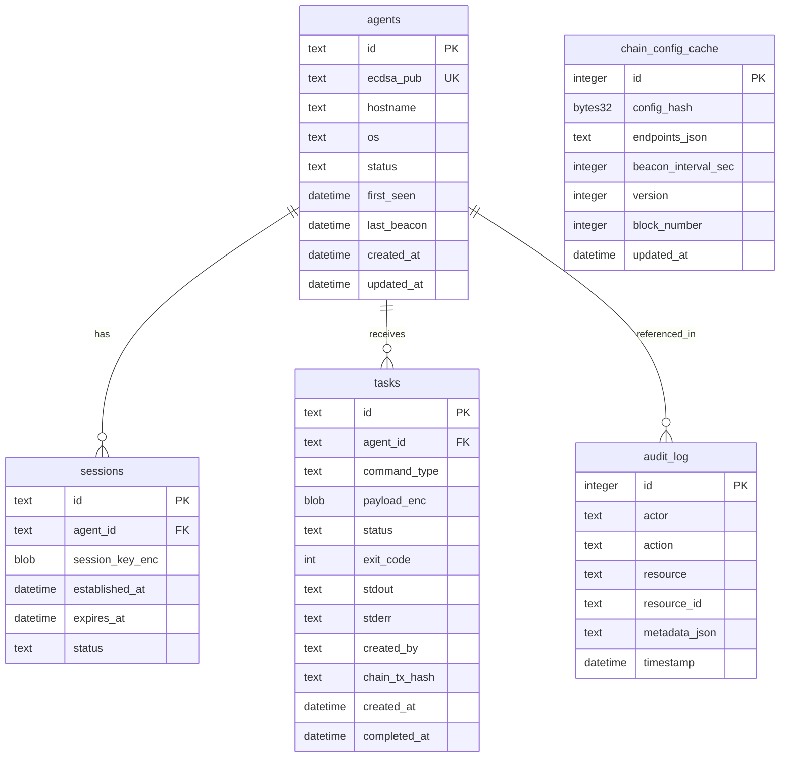

# 04 — Data Models

## Diagrama ER — SQLite



---

## SQLite — Esquemas

Base de datos: `c2.db` (path configurable vía `C2_DB_PATH`).

### Tabla `agents`

| Columna | Tipo | Constraints | Descripción |
|---------|------|-------------|-------------|
| `id` | TEXT | PK | UUID v4 |
| `ecdsa_pub` | TEXT | NOT NULL, UNIQUE | Clave pública secp256k1 hex |
| `hostname` | TEXT | NOT NULL | Hostname del agente |
| `os` | TEXT | NOT NULL | `linux-amd64`, `linux-arm64`, `windows-amd64` |
| `status` | TEXT | NOT NULL, DEFAULT `active` | `active`, `inactive`, `revoked` |
| `first_seen` | DATETIME | NOT NULL | Primera conexión |
| `last_beacon` | DATETIME | | Último beacon |
| `created_at` | DATETIME | NOT NULL | |
| `updated_at` | DATETIME | NOT NULL | |

**Índices**: `idx_agents_status`, `idx_agents_last_beacon`

### Tabla `sessions`

| Columna | Tipo | Constraints | Descripción |
|---------|------|-------------|-------------|
| `id` | TEXT | PK | `sess_{random}` |
| `agent_id` | TEXT | FK → agents.id | |
| `session_key_enc` | BLOB | NOT NULL | Clave AES cifrada con server master key |
| `established_at` | DATETIME | NOT NULL | |
| `expires_at` | DATETIME | NOT NULL | Default +24h |
| `status` | TEXT | NOT NULL | `active`, `expired`, `revoked` |

**Índices**: `idx_sessions_agent_id`, `idx_sessions_expires_at`

### Tabla `tasks`

| Columna | Tipo | Constraints | Descripción |
|---------|------|-------------|-------------|
| `id` | TEXT | PK | UUID |
| `agent_id` | TEXT | FK → agents.id | |
| `command_type` | TEXT | NOT NULL | `shell`, `iot_command`, `msf_module` (opcional) |
| `payload_enc` | BLOB | | Payload cifrado at-rest |
| `status` | TEXT | NOT NULL | `pending`, `delivered`, `completed`, `failed`, `timeout` |
| `exit_code` | INTEGER | | Resultado |
| `stdout` | TEXT | | Salida (lab; cifrado opcional fase 2) |
| `stderr` | TEXT | | |
| `created_by` | TEXT | NOT NULL | Operador username |
| `chain_tx_hash` | TEXT | | Opcional: tx si task auditada on-chain |
| `created_at` | DATETIME | NOT NULL | |
| `completed_at` | DATETIME | | |

**Índices**: `idx_tasks_agent_status`, `idx_tasks_created_at`

### Tabla `audit_log`

| Columna | Tipo | Constraints | Descripción |
|---------|------|-------------|-------------|
| `id` | INTEGER | PK AUTOINCREMENT | |
| `actor` | TEXT | NOT NULL | `operator:{user}` o `agent:{id}` |
| `action` | TEXT | NOT NULL | `handshake`, `task_create`, `config_update` |
| `resource` | TEXT | NOT NULL | `agent`, `task`, `session` |
| `resource_id` | TEXT | | ID del recurso |
| `metadata_json` | TEXT | | JSON libre |
| `timestamp` | DATETIME | NOT NULL | |

**Índices**: `idx_audit_timestamp`, `idx_audit_actor`

### Tabla `chain_config_cache`

| Columna | Tipo | Constraints | Descripción |
|---------|------|-------------|-------------|
| `id` | INTEGER | PK AUTOINCREMENT | |
| `config_hash` | TEXT | NOT NULL | bytes32 hex del contrato |
| `endpoints_json` | TEXT | NOT NULL | JSON array resuelto off-chain |
| `beacon_interval_sec` | INTEGER | NOT NULL | |
| `version` | INTEGER | NOT NULL | |
| `block_number` | INTEGER | NOT NULL | Bloque del evento |
| `updated_at` | DATETIME | NOT NULL | |

**Índices**: `idx_chain_config_version` (UNIQUE en `version`)

### Migraciones

- Fase 2: `migrations/001_initial.sql` con DDL anterior
- Versionado schema en tabla `schema_version`

---

## Redis — Keys y estructuras

| Key pattern | Tipo | TTL | Descripción |
|-------------|------|-----|-------------|
| `handshake:nonce:{nonce}` | STRING | 60s | Nonce pendiente handshake |
| `session:{agent_id}` | HASH | 24h | `session_key_id`, `established_at` |
| `beacon:pending:{agent_id}` | LIST | — | Queue de tareas para entregar en beacon |
| `rate:ip:{ip}` | STRING (counter) | 60s | Rate limit por IP |
| `rate:agent:{agent_id}` | STRING (counter) | 60s | Rate limit beacon |
| `rate:operator:{user}` | STRING (counter) | 60s | Rate limit operador |
| `idempotency:{nonce}` | STRING | 120s | Anti-replay beacon/handshake |

### Pub/Sub channels

| Channel | Payload | Suscriptores |
|---------|---------|--------------|
| `tasks:new` | `{"task_id","agent_id"}` | WebSocket hub |
| `chain:config:updated` | `{"version","block_number"}` | API, agent notifier |

### `beacon:pending:{agent_id}` LIST

Elementos JSON:

```json
{
  "task_id": "uuid",
  "command_type": "shell",
  "payload": { "argv": ["whoami"] }
}
```

---

## Smart Contract — `C2Registry`

**Red**: Polygon Amoy (`chainId: 80002`)  
**Solidity**: 0.8.20+  
**Archivo futuro**: `contracts/C2Registry.sol`

### Structs

```solidity
struct Operator {
    address wallet;        // Wallet Polygon del operador
    bytes32 pubKeyHash;    // SHA256(ecdsa_pub_bytes) — identidad off-chain
    bool active;           // false si revocado
}

struct C2Config {
    bytes32 endpointHash;       // SHA256(primary_endpoint_url)
    uint32 beaconIntervalSec;   // Intervalo beacon recomendado
    uint64 version;             // Monotonic, incrementa en cada update
}
```

### State variables (conceptual)

| Variable | Tipo | Descripción |
|----------|------|-------------|
| `owner` | address | Deployer; bootstrap |
| `operators` | mapping(address => Operator) | Operadores registrados |
| `operatorCount` | uint256 | Contador |
| `currentConfig` | C2Config | Config activa |
| `configHistory` | mapping(uint64 => C2Config) | Historial por version |

### Funciones

| Función | Visibilidad | Modifiers | Descripción |
|---------|-------------|-----------|-------------|
| `registerOperator(address wallet, bytes32 pubKeyHash)` | external | `onlyOwner` | Registra operador (bootstrap) |
| `revokeOperator(address wallet)` | external | `onlyActiveOperator` o `onlyOwner` | Revoca operador |
| `updateConfig(bytes32 endpointHash, uint32 beaconIntervalSec)` | external | `onlyActiveOperator` | Nueva config; incrementa `version` |
| `getConfig()` | external view | — | Retorna `C2Config` actual |
| `getOperator(address wallet)` | external view | — | Retorna `Operator` |
| `isActiveOperator(address wallet)` | external view | — | bool |

### Eventos

```solidity
event OperatorRegistered(address indexed wallet, bytes32 pubKeyHash);
event OperatorRevoked(address indexed wallet);
event ConfigUpdated(
    uint64 indexed version,
    bytes32 endpointHash,
    uint32 beaconIntervalSec,
    address indexed updatedBy
);
```

### Access control

- `onlyOwner`: funciones de bootstrap (`registerOperator` inicial)
- `onlyActiveOperator`: `updateConfig`, `revokeOperator` (operadores activos)
- Operador debe tener `operators[wallet].active == true`

### Validaciones on-chain

- `beaconIntervalSec`: mínimo 5, máximo 3600
- `endpointHash`: no `bytes32(0)`
- `version`: auto-increment en cada `updateConfig`
- No duplicate active operator con mismo `pubKeyHash`

### Gas y despliegue (Amoy)

- Deploy estimado: ~1.5M gas
- Almacenar `C2_REGISTRY_ADDRESS` en env del server y agent
- Verificar contrato en Amoy Polygonscan post-deploy

---

## Extensiones IoT — Centro de Inteligencia Residencial

Fusión con gateways y dispositivos residenciales (ver [07_iot_residential_fusion.md](./07_iot_residential_fusion.md)).

### Extensión tabla `agents` (gateway IoT)

| Columna adicional | Tipo | Descripción |
|-------------------|------|-------------|
| `agent_role` | TEXT | `generic`, `iot_gateway` (default `generic`) |
| `residential_unit` | TEXT | ID hogar/bloque (opcional) |
| `gateway_id` | TEXT | Identificador gateway en conjunto residencial |

### Tabla `iot_devices` (Fase 2)

| Columna | Tipo | Descripción |
|---------|------|-------------|
| `id` | TEXT PK | UUID dispositivo |
| `gateway_agent_id` | TEXT FK → agents.id | Gateway que reporta |
| `device_type` | TEXT | `motion_sensor`, `camera`, `smart_lock`, `energy_meter`, `water_meter` |
| `zone` | TEXT | Zona residencial (entrada, cocina, etc.) |
| `pub_key_hash` | TEXT | SHA256 de clave pública del dispositivo (opcional MVP) |
| `status` | TEXT | `active`, `inactive`, `revoked` |
| `lock_state` | TEXT | Solo `smart_lock`: `locked`, `unlocked` (simulado) |
| `last_event_at` | DATETIME | Último evento reportado |

Acciones soportadas por `device_type` (vía `iot_command`):

| `device_type` | Acciones |
|---------------|----------|
| `smart_lock` | `lock`, `unlock`, `status` |
| `motion_sensor` | Eventos simulados (`iot_event`) |
| `energy_meter`, `water_meter` | `read_telemetry` |

### Redis keys IoT

| Key pattern | Uso |
|-------------|-----|
| `iot:event:{gateway_id}` | LIST de eventos pendientes de consolidar |
| `iot:telemetry:{device_id}` | Última lectura cacheada |
| `iot:lock:{device_id}` | Estado simulado cerradura (`locked`/`unlocked`) |

### Extensión `C2Registry` — dispositivos IoT

| Función (Fase 2) | Descripción |
|------------------|-------------|
| `registerDevice(bytes32 pubKeyHash, bytes32 gatewayHash)` | Registro on-chain de dispositivo bajo gateway |
| `revokeDevice(bytes32 pubKeyHash)` | Revocación de dispositivo comprometido |
| Evento `DeviceRegistered` | `pubKeyHash`, `gatewayHash`, `registeredBy` |

---

## Mapeo API ↔ Persistencia

| Operación API | SQLite | Redis |
|---------------|--------|-------|
| Handshake complete | INSERT `agents`, `sessions` | SET `session:{id}`, DEL nonce |
| Beacon | UPDATE `agents.last_beacon` | LPOP `beacon:pending` o ACK |
| POST /tasks | INSERT `tasks` | RPUSH `beacon:pending`, PUBLISH `tasks:new` |
| task_result | UPDATE `tasks` | — |
| ChainIndexer event | UPSERT `chain_config_cache` | PUBLISH `chain:config:updated` |

---

## Referencias cruzadas

- API: [03_api_design.md](./03_api_design.md)
- Seguridad (claves, hashes): [05_security_specs.md](./05_security_specs.md)
- Arquitectura: [02_system_architecture.md](./02_system_architecture.md)
- Fusión IoT: [07_iot_residential_fusion.md](./07_iot_residential_fusion.md)
