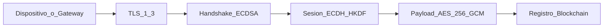

# 05 — Security Specifications

## Principios

1. **Security from day zero**: la seguridad no es capa posterior; cada componente nace cifrado y autenticado
2. **Defense in depth**: TLS + autenticación ECDSA + cifrado de payloads + registry on-chain
3. **Least privilege**: operadores con scope mínimo; agentes solo acceden a sus propios recursos
4. **No secrets in repo**: claves vía env, vault o archivos fuera de git
5. **Fail secure**: error de crypto → rechazo, nunca bypass
6. **Audit everything**: `audit_log` para acciones sensibles

---

## Seguridad aplicada desde el inicio

Cada dispositivo (agente, gateway IoT) pasa por la cadena de seguridad completa **antes de transmitir cualquier dato útil**:



| Momento | Mecanismo activado | Sin esto, no procede |
|---------|--------------------|-----------------------|
| Conexión TCP/TLS | TLS 1.3 obligatorio | Rechazo de conexión plana |
| Primer request | Handshake challenge ECDSA | Sin identidad verificada → no hay sesión |
| Derivación de clave | ECDH P-256 + HKDF-SHA256 | Sin clave de sesión → no cifra payloads |
| Todo payload posterior | AES-256-GCM con nonce + tag | Beacon, tarea, resultado, IoT — todo cifrado |
| Post-handshake | `registerDevice` / `registerOperator` en Polygon Amoy | Identidad trazable on-chain |

**Resultado**: no existe un momento donde el sistema opere "en abierto". La seguridad es **prerrequisito funcional**, no feature opcional.

---

## Criptografía

### AES-256-GCM (payloads post-handshake)

| Parámetro | Valor |
|-----------|-------|
| Algoritmo | AES-256-GCM |
| Clave | 32 bytes (256 bit) |
| IV / Nonce | 12 bytes, aleatorio por mensaje (`crypto/rand`) |
| Tag | 128 bits (16 bytes) |
| Encoding | Base64 en envelope JSON |

**Proceso encrypt**:

1. Serializar plaintext JSON UTF-8
2. Generar IV 12 bytes aleatorios
3. `GCM.Seal` → ciphertext + tag
4. Construir envelope `{v, alg, iv, ct, tag}`

**Proceso decrypt**:

1. Decodificar base64
2. Verificar tag (GCM autentica)
3. Rechazar si tag inválido (tampering)

### ECDSA secp256k1 (identidad agente y operador off-chain)

| Uso | Input firmado |
|-----|---------------|
| Handshake | `nonce` (hex) |
| Beacon / REST | `timestamp \|\| nonce \|\| SHA256(body)` |
| Operador crítico | Payload JSON canonical |

- Curva: secp256k1 (compatible con wallets Ethereum)
- Formato firma: R || S hex (64 bytes) o DER según implementación documentada en código
- Verificación: rechazar firmas malleables (low-S normalización)

### ECDH P-256 + HKDF-SHA256 (clave de sesión)

| Paso | Detalle |
|------|---------|
| Curva ECDH | P-256 (`elliptic.P256()`) |
| Shared secret | ECDH(agent_ecdh_priv, server_ecdh_pub) |
| HKDF | salt vacío o fijo documentado; info = `"c2-session-v1"` |
| Output | 32 bytes → clave AES-256 |

**Separación de curvas**: ECDSA secp256k1 para identidad (chain-aligned); ECDH P-256 para sesión (NIST, amplio soporte en Go std).

---

## Camuflaje operativo y realismo (lab autorizado)

Los retadores recomiendan **innovación** y operación **realista** en lab: el canal no debe parecer un C2 clásico fácil de fingerprint. Esto **no** es evasión de AV en binarios; es **camuflaje de comunicación y metadata** dentro del ejercicio autorizado.

### Objetivo

Reducir detección por inspección superficial (logs, IDS de lab, analistas en demo) mientras el flujo C2 real funciona bajo apariencia de **plataforma IoT / API cloud legítima**.

### Técnicas documentadas

| Técnica | Implementación | Beneficio |
|---------|----------------|-----------|
| **Tráfico tipo API IoT** | Paths `/api/v1/...`, JSON estándar, TLS 1.3 | Beacon no parece shell remoto ni tráfico MSF |
| **Envelopes cifrados** | Payload opaco base64; sin comandos en claro | Contenido indistinguible de datos de aplicación |
| **Metadata on-chain** | Solo `endpointHash`, `pubKeyHash`, version | URLs y rotación de C2 no en DNS/logs estáticos |
| **Beacon jitter** | Intervalo `beaconIntervalSec ± random(0..15%)` desde config on-chain | Evita patrón fijo detectable por SOC |
| **User-Agent / headers** | Emular cliente IoT cloud (configurable en agente) | Fingerprint HTTP menos obvio |
| **Separación comando / chain** | Comandos solo por WS/REST cifrado; chain solo config | Blockchain no expone operación ofensiva |
| **Gateway como cover story** | Narrativa Centro Inteligencia Residencial | Demo coherente: “smart home API”, no “malware panel” |

### Flujo camuflado (vista externa)

```text
Analista de red (lab) ve:
  HTTPS → api/v1/ws/agent
  JSON con campo "encrypted" (blob)
  Lecturas eth_call ocasionales a Polygon (config, no comandos)

No ve en claro:
  Comandos shell, lock/unlock, URLs C2 primarias, claves de sesión
```

### Comandos realistas — cerraduras (simulado)

En lab, el gateway **simula** la cerradura; el operador envía tarea `iot_command`:

```json
{
  "target_device": "lock-main",
  "action": "unlock",
  "duration_sec": 5,
  "reason": "operator_authorized_lab"
}
```

Respuesta simulada incluye estado (`locked`/`unlocked`), timestamp y `device_id` — auditable en SQLite y opcionalmente referenciado en `audit_log`.

### Sensores simulados

Scripts en VM (`scripts/sim/sensor_motion.sh` o proceso Go) generan eventos periódicos:

- Movimiento en zona (`entrada`, `garaje`)
- Variación aleatoria de intervalo
- Payload realista para demo (no constantes obvias)

### Límites éticos del camuflaje

- Solo en **VLAN lab** con consentimiento documentado
- No desplegar técnicas de camuflaje contra redes de terceros
- Demo ante jurado debe **explicar** el camuflaje (transparencia educativa), no ocultar al evaluador

### [Probable] Inconsistencia capa 4 vs capa 7 (puerto `:8443`)

El MVP y el lab usan **`:8443`** (`C2_PORT`, documentado en API y demo). Ese puerto es habitual para paneles HTTPS alternativos / administración — no para tráfico IoT residencial genuino.

| Capa | Camuflaje documentado | Realismo frente a SOC |
|------|----------------------|------------------------|
| **Capa 7** (HTTP) | Paths `/api/v1`, `User-Agent: ResidentialHub/1.0`, JSON opaco | Apariencia de API IoT cloud |
| **Capa 4** (TCP) | Puerto **8443** fijo en lab | IoT real suele ir a **443** (HTTPS), **8883** (MQTT/TLS) o **5683** (CoAP) |

Un analista de red que compare fingerprint **puerto + protocolo** marcará `:8443` con tráfico “tipo panel admin” aunque los headers parezcan IoT. El camuflaje de capa 7 **no compensa** el puerto de capa 4 en inspección superficial.

**Decisión MVP (hackathon):** `:8443` prioriza simplicidad de lab (sin conflicto con otros servicios en `:443`, sin proxy reverso). **No** se presenta como evasión completa de detección por puerto.

**Mejora futura (post-MVP):** reverse proxy en `:443` con path dedicado, o terminación TLS en `:443` y binding interno en `:8443`; para MQTT cover story, puerto **8883** con bridge distinto (fuera del alcance actual).

---

## Timestamps anti-replay

| Parámetro | Valor |
|-----------|-------|
| Ventana | ±30 segundos desde `X-Timestamp` |
| Nonce | 32 bytes hex, único; almacenado en Redis `idempotency:{nonce}` TTL 120s |
| Rechazo | Timestamp fuera de ventana → 400 `NONCE_EXPIRED` o 409 `REPLAY_DETECTED` |

---

## Gestión de claves

### Jerarquía

```text
Server Master Key (env C2_MASTER_KEY, 32 bytes hex)
    └── cifra session_key_enc en SQLite

Agent ECDSA keypair (generado en agente, nunca exporta privada)
Agent ECDH keypair (ephemeral por handshake)

Operator wallet (Polygon Amoy)
    └── firma updateConfig on-chain

Operator JWT secret (env JWT_SECRET)
    └── tokens API operador
```

### Generación

| Clave | Ubicación | Algoritmo |
|-------|-----------|-----------|
| Agent ECDSA | `cmd/agent` startup | secp256k1 `GenerateKey` |
| Agent ECDH | Por handshake | P-256 ephemeral |
| Server ECDH | Por handshake request | P-256 ephemeral |
| Server master | Env / vault | 32 bytes random |
| Operator wallet | MetaMask / hardhat | Ethereum standard |

### Rotación

| Clave | Frecuencia | Procedimiento |
|-------|------------|---------------|
| Session AES | 24h o `session_rotate` | Nuevo handshake |
| Server master | Post-ejercicio lab | Re-encrypt sessions o force re-handshake |
| Operator wallet | Post-ejercicio | Revoke on-chain + nuevo `registerOperator` |
| JWT secret | Post-ejercicio | Invalida tokens activos |

### Almacenamiento prohibido

- No commitear: `OPERATOR_PRIVATE_KEY`, `C2_MASTER_KEY`, `JWT_SECRET`, agent private keys
- `.env` en `.gitignore`
- Test fixtures: claves dedicadas `test-only-*`, nunca producción

### Resolución endpoint (failover)

```
endpointHash_on_chain == SHA256(primary_url_utf8)
```

El agente verifica el hash antes de conectar una URL del mapa local (`C2_URL_CANDIDATES`).

### [Suposición] Límites de `endpointHash` — modelo de amenazas explícito

`endpointHash` on-chain **no es** un mecanismo de autenticación fuerte del endpoint. Es **binding** entre config publicada por operadores autorizados y el conjunto finito de URLs que el agente ya conoce en deploy.

| Escenario | ¿`endpointHash` ayuda? | Notas |
|-----------|------------------------|-------|
| MITM redirige a URL **no** en `C2_URL_CANDIDATES` | **Sí** | `SHA256(url_atacante) ≠ endpointHash` → agente aborta |
| RPC blockchain falso devuelve hash de URL legítima distinta | **Parcial** | Solo si el mapa local no incluye esa URL |
| Atacante compromete una URL **que sí está** en el mapa local | **No** | Hash coincide; agente conecta al servidor malicioso |
| Atacante conoce el mapa local completo del agente | **No añade secreto** | El hash confirma cuál candidata usar, no oculta candidatas |
| Operador malicioso firma `updateConfig` on-chain | **No** | Operador autorizado puede rotar a cualquier hash de URL en el mapa |

**Propiedad de seguridad real:** evita que un tercero **inyecte** un endpoint nuevo vía RPC o DNS sin que coincida con la config firmada on-chain y con una URL preconfigurada. **No protege** contra compromiso del host en una URL candidata ni contra operador o implant comprometido.

Mitigaciones complementarias (documentadas en STRIDE): TLS 1.3, pinning de certificado (`C2_CERT_PIN`), handshake ECDSA, operadores on-chain para `updateConfig`.

---

## Modelo de amenazas (STRIDE)

### MITM (Man-in-the-Middle)

| Vector | Impacto | Mitigación |
|--------|---------|------------|
| Interceptar TLS | Leer/modificar tráfico | TLS 1.3 obligatorio; cert pinning opcional en agente (`C2_CERT_PIN`) |
| Falso servidor C2 | Robo de handshake | TLS + cert pin; `endpointHash` solo si URL está en mapa local y hash coincide (ver límites arriba) |
| RPC blockchain falso | Config maliciosa | Hash vs mapa local; no sustituye validación de cert ni protección si URL candidata está comprometida |
| URL candidata comprometida | Implant conecta a atacante | **Fuera de alcance de `endpointHash`** — requiere hardening de host, pin de cert, rotación on-chain por operador legítimo |

**Fase 2 opcional**: mTLS entre agente y servidor.

### Replay

| Vector | Impacto | Mitigación |
|--------|---------|------------|
| Reenviar beacon antiguo | Estado falso / DoS | Timestamp ±30s + nonce único en Redis |
| Reenviar handshake | Sesión duplicada | Nonce one-time `handshake:nonce:{nonce}` |
| Reenviar task_result | Corrupción estado | task_id + nonce idempotency |

### Spoofing

| Vector | Impacto | Mitigación |
|--------|---------|------------|
| Falso agente | Acceso C2 | ECDSA handshake; `ecdsa_pub` único en DB |
| Falso operador | Crear tareas | JWT + wallet on-chain para config updates |
| Falso servidor | Implant mal dirigido | TLS + cert pin; `endpointHash` acotado a mapa local (ver límites) |

### Tampering

| Vector | Impacto | Mitigación |
|--------|---------|------------|
| Modificar payload cifrado | Comando alterado | AES-GCM auth tag |
| Modificar config off-chain | Failover malicioso | Hash on-chain + mapa local; no evita compromiso de URL ya listada (ver límites `endpointHash`) |
| Modificar task en Redis | Ejecución arbitraria | Tasks firmadas por operador (fase 2) |

### Repudiation

| Vector | Mitigación |
|--------|------------|
| Operador niega crear task | `audit_log` + `created_by` |
| Cambio config | Evento `ConfigUpdated` on-chain inmutable |

### Information Disclosure

| Vector | Mitigación |
|--------|------------|
| Payloads en claro en DB | `payload_enc`, `session_key_enc` |
| Logs con stdout | Sanitizar logs; stdout solo en DB acotada |
| Claves en memoria | No loguear secrets; wipe buffers post-uso |

### Denial of Service

| Vector | Mitigación |
|--------|------------|
| Flood handshake/beacon | Rate limit Redis por IP/agent |
| Conexiones WS masivas | Límite conexiones por IP |
| Chain spam | Solo operadores autorizados pueden `updateConfig` |

---

## Hardening del servidor

| Área | Medida |
|------|--------|
| Network | Bind solo interfaces lab; firewall deny public |
| HTTP | Deshabilitar HTTP plano; solo HTTPS |
| Headers | `Strict-Transport-Security`, `X-Content-Type-Options` |
| Input | Validar JSON schema; límite body 64KB |
| SQLite | Prepared statements; sin SQL dinámico |
| Redis | Password auth; no exponer a internet |
| Process | Run as non-root en container |
| Updates | Dependencias auditadas (`go mod`, `npm audit`) |

---

## Superficie de ataque

| Componente | Exposición | Prioridad |
|------------|------------|-----------|
| REST API | Red lab | Alta |
| WebSocket | Red lab | Alta |
| Redis | Internal only | Media |
| SQLite file | Server filesystem | Media |
| Polygon RPC | Outbound HTTPS | Media |
| Operator login | Red lab | Alta |
| Agent binary | Host VM | Alta (physical access) |

---

## Disclaimer legal y uso autorizado

Este sistema es **software de investigación educativa** para laboratorios de ciberseguridad autorizados.

- Uso solo en sistemas y redes con **permiso explícito** de los propietarios
- El equipo Inge Lean y participantes del hackathon asumen responsabilidad del despliegue conforme a leyes locales
- **Prohibido** usar contra infraestructura de terceros, producción o internet público sin aislamiento
- Polygon Amoy es testnet sin valor real; no desplegar en mainnet
- Destruir datos y claves al finalizar el ejercicio

---

## Referencias cruzadas

- API headers y envelopes: [03_api_design.md](./03_api_design.md)
- Modelos y contrato: [04_data_models.md](./04_data_models.md)
- Casos de prueba crypto: [06_testing_strategy.md](./06_testing_strategy.md)
- Camuflaje operativo: sección en este documento
