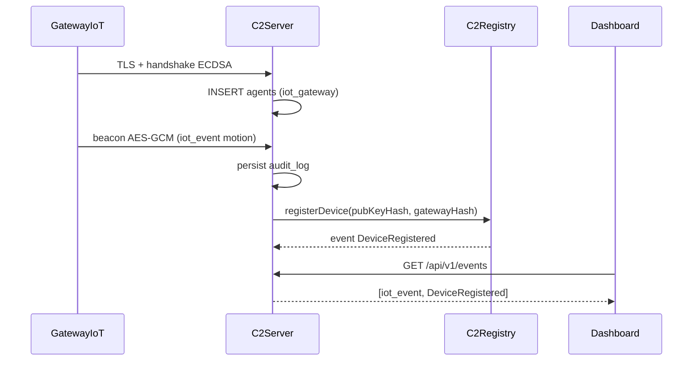

# 06 — Testing Strategy

## Enfoque TDD

Todo desarrollo en Fase 2 sigue el ciclo **Red → Verde → Refactor**:

1. **Red**: Escribir test que falla definiendo comportamiento esperado
2. **Verde**: Implementar código mínimo para pasar el test
3. **Refactor**: Mejorar sin cambiar comportamiento; tests siguen verdes

No se mergea código sin tests para módulos `internal/crypto`, `internal/handshake`, `internal/api`, `contracts/`.

---

## Pirámide de pruebas

```text
        ┌─────────┐
        │   E2E   │  1–3 flujos críticos
        ├─────────┤
        │ Integr. │  API + DB + Redis + WS
        ├─────────┤
        │ Contract│  Hardhat C2Registry
        ├─────────┤
        │  Unit   │  Crypto, handshake, parsers
        └─────────┘
```

| Nivel | Herramienta | Alcance |
|-------|-------------|---------|
| Unit | Go `testing`, `testify` | Funciones puras, crypto, validadores |
| Contract | Hardhat + Chai | `C2Registry.sol` |
| Integration | Go + testcontainers (Redis), SQLite `:memory:` | Handlers HTTP, WS hub |
| E2E | Go test + subprocess agent | Handshake → beacon → whoami |

---

## Cobertura objetivo (MVP)

| Paquete | Cobertura mínima |
|---------|------------------|
| `internal/crypto` | ≥ 70% |
| `internal/handshake` | ≥ 70% |
| `internal/api` | ≥ 60% |
| `contracts/` | 100% funciones públicas |

Medición: `go test -coverprofile=coverage.out ./...`

---

## Escenarios de validación por capas

Cada capa de la plataforma se valida con escenarios que verifican integración real, no solo funciones aisladas.

### Escenario 1 — Conexión segura (Capa 1 + Capa 2)

```text
Dispositivo/gateway → TLS → handshake ECDSA → sesión ECDH → beacon AES-GCM → server acepta
```

| Paso | Verificación |
|------|-------------|
| 1. Dispositivo inicia TLS | Conexión aceptada solo con TLS 1.3 |
| 2. Handshake ECDSA | Agente registrado en SQLite con `ecdsa_pub` única |
| 3. Derivación ECDH + HKDF | Ambos lados generan misma clave AES-256 |
| 4. Primer beacon cifrado | Server descifra, actualiza `last_beacon`, responde ACK |
| **Tests**: CRYPTO-001, HS-001…005, API-001 |

### Escenario 2 — Registro en blockchain (Capa 2)

```text
Operador → registerOperator on-chain → updateConfig → agente lee getConfig() → valida endpointHash
```

| Paso | Verificación |
|------|-------------|
| 1. Deploy C2Registry | Contrato en Polygon Amoy con `owner` |
| 2. Operador registrado | Evento `OperatorRegistered` emitido |
| 3. Config actualizada | Evento `ConfigUpdated` con `endpointHash` y `beaconIntervalSec` |
| 4. Agente lee config | `getConfig()` retorna version correcta; hash coincide con URL local |
| **Tests**: SC-001…006, CHAIN-001…002, CAMO-003 |

### Escenario 3 — Respuesta ante fallo (Capa 1 + Capa 2)

```text
Server primario cae → agente detecta timeout → lee getConfig() on-chain → reconecta a backup
```

| Paso | Verificación |
|------|-------------|
| 1. Server deja de responder | 2 × beacon_interval sin ACK |
| 2. Agente lee blockchain | `getConfig()` retorna `endpointHash` de backup |
| 3. Verifica hash | `SHA256(backup_url) == endpointHash` |
| 4. Reconexión exitosa | Handshake o resume con backup server |
| **Tests**: E2E-002, CAMO-003 |

### Escenario 4 — Flujo completo device→handshake→blockchain (las tres capas)

```text
Gateway IoT → handshake → beacon → iot_event → registerDevice on-chain → dashboard muestra estado
```



| Paso | Verificación |
|------|-------------|
| 1. Gateway completa handshake | `agent_role=iot_gateway` en SQLite |
| 2. Evento IoT cifrado llega | Audit log registra `iot_event` |
| 3. Identidad registrada on-chain | `DeviceRegistered` visible en Amoy explorer |
| 4. Dashboard refleja estado | Panel muestra agente activo + evento |
| **Tests**: IOT-001…005, E2E-003, E2E-INTEG-001 (nuevo) |

### Test de integración nuevo

| ID | Tipo | Descripción | Expected |
|----|------|-------------|----------|
| E2E-INTEG-001 | E2E | Flujo completo device→handshake→evento→blockchain→dashboard | Agente registrado, evento visible, identidad on-chain, dashboard actualizado |

---

## Criterios de aceptación del reto Aligo

Estos criterios convierten el documento del reto en verificaciones concretas. El proyecto no se considera listo para entrega si falla cualquiera de los mínimos.

### Mínimos obligatorios

| ID | Mínimo del reto | Prueba / evidencia |
|----|-----------------|--------------------|
| MIN-001 | Servidor C2 acepta al menos un agente | E2E: server en ejecución + handshake exitoso |
| MIN-002 | Agente conectado ejecuta comandos remotos | E2E-001: tarea `whoami` entregada y ejecutada |
| MIN-003 | Operador recibe resultados | API: `GET /tasks/{id}` retorna `completed`, `stdout`, `exit_code` |
| MIN-004 | Canal extremo a extremo funciona en demo | Video/demo muestra handshake → beacon → task → result |
| MIN-005 | Cuatro entregables listos | Repo, documentación, video y demo verificados antes del cierre |
| MIN-006 | C2 core es desarrollo propio | Server + protocolo + agente propios; Metasploit no sustituye el C2 |

### Criterios ponderados

| Criterio | Peso | Evidencia técnica requerida |
|----------|------|-----------------------------|
| Innovación técnica | 35% | Contrato `C2Registry` desplegado en Polygon Amoy, evento `ConfigUpdated`, lectura `getConfig()` desde server/agent |
| Funcionalidad / que sirva | 25% | Flujo funcional completo sin intervención manual interna: levantar server, conectar agente, crear task, ver resultado |
| Robustez y diseño de arquitectura | 20% | Reconexión/failover probado, cifrado AES-GCM validado, anti-replay probado, separación server/agent/chain/store |
| Calidad de código y arquitectura | 10% | Tests verdes, estructura modular, README de ejecución, sin secrets, CI documentado |
| Presentación y documentación | 10% | SDD completo, video 3-7 min, demo en vivo con explicación de decisiones |

### Criterios de demo

| ID | Escena | Resultado esperado |
|----|--------|--------------------|
| DEMO-001 | Levantar servidor C2 | Healthcheck `ok`, Redis/SQLite disponibles |
| DEMO-002 | Conectar agente | Agente aparece como `active` |
| DEMO-003 | Ejecutar comando | `whoami` retorna salida visible para operador |
| DEMO-004 | Mostrar cifrado/protocolo | Logs o explicación muestran envelope cifrado, sin exponer secretos |
| DEMO-005 | Mostrar blockchain | Explorer Amoy o script muestra `C2Registry` y config activa |
| DEMO-006 | Simular resiliencia | Failover o reconexión automática demostrada |
| DEMO-007 | Evento IoT residencial | Gateway reporta `iot_event` o `iot_telemetry` cifrado; operador ve resultado |
| DEMO-008 | Comando cerradura | Operador `unlock` → gateway simula → estado `unlocked` en API |
| DEMO-009 | Camuflaje ante jurado | Explicar tráfico como API IoT; mostrar blob cifrado + config on-chain sin URL en claro |
| DEMO-010 | Dashboard | Abrir panel; agentes, tareas, eventos IoT, estado cerraduras y config blockchain visibles |
| DEMO-011 | Flujo completo 3 capas | Device conecta → handshake → evento → blockchain → dashboard (un solo flujo demostrado) |

---

## Catálogo de casos de prueba

### Unit — Crypto (`internal/crypto`)

| ID | Tipo | Descripción | Input | Expected |
|----|------|-------------|-------|----------|
| CRYPTO-001 | Unit | AES-GCM roundtrip | plaintext JSON, random key | decrypt(encrypt(p)) == p |
| CRYPTO-002 | Unit | ECDSA verify válido | keypair, message | verify OK |
| CRYPTO-003 | Unit | ECDSA verify inválido | wrong sig | verify fails |
| CRYPTO-004 | Unit | HKDF determinista | fixed shared secret + info | misma clave 32 bytes |
| CRYPTO-005 | Unit | GCM tamper detect | modificar 1 byte de ct | decrypt error |
| CRYPTO-006 | Unit | IV uniqueness | 1000 encrypts | todos IV distintos |

### Unit — Handshake (`internal/handshake`)

| ID | Tipo | Descripción | Input | Expected |
|----|------|-------------|-------|----------|
| HS-001 | Unit | Nonce único | 1000 generates | sin colisiones |
| HS-002 | Unit | Rechaza firma expirada | timestamp > 30s old | error NONCE_EXPIRED |
| HS-003 | Unit | Rechaza replay nonce | mismo nonce 2x | error NONCE_REUSED |
| HS-004 | Unit | ECDH session key match | agent + server ECDH | misma clave ambos lados |
| HS-005 | Unit | Rechaza pubkey inválida | malformed hex | error SIGNATURE_INVALID |

### Integration — API (`internal/api`)

| ID | Tipo | Descripción | Setup | Expected |
|----|------|-------------|-------|----------|
| API-001 | Integration | Handshake completo | SQLite mem + Redis tc | agent + session en DB |
| API-002 | Integration | Beacon WS entrega task | pending task en Redis | agent recibe task envelope |
| API-003 | Integration | Operator sin JWT | GET /agents | 401 UNAUTHORIZED |
| API-004 | Integration | POST /tasks crea pending | JWT válido | task status pending + Redis LIST |
| API-005 | Integration | task_result completa | beacon + result | task status completed |
| API-006 | Integration | Rate limit handshake | 11 req / min IP | 429 RATE_LIMITED |

### Contract — `C2Registry` (Hardhat)

| ID | Tipo | Descripción | Expected |
|----|------|-------------|----------|
| SC-001 | Contract | Solo operador activo updateConfig | non-operator reverts |
| SC-002 | Contract | getConfig última versión | version incrementa |
| SC-003 | Contract | ConfigUpdated evento | campos correctos |
| SC-004 | Contract | revokeOperator | active=false |
| SC-005 | Contract | beaconInterval bounds | <5 o >3600 reverts |
| SC-006 | Contract | endpointHash zero | bytes32(0) reverts |

### Chain indexer (`internal/chain`)

| ID | Tipo | Descripción | Expected |
|----|------|-------------|----------|
| CHAIN-001 | Integration | Indexer parse ConfigUpdated | cache DB actualizado |
| CHAIN-002 | Integration | getConfig eth_call | coincide con deploy |

### IoT — Gateway residencial (`cmd/iot-gateway` o agent extendido)

| ID | Tipo | Descripción | Expected |
|----|------|-------------|----------|
| IOT-001 | Integration | Gateway handshake como agente | `agent_role=iot_gateway` en DB |
| IOT-002 | Integration | Beacon con `iot_event` cifrado | Servidor acepta y persiste audit |
| IOT-003 | Integration | Telemetría medidor cifrada | `iot_telemetry` en envelope válido |
| IOT-004 | E2E | Operador consulta lectura medidor | Task `iot_command` + resultado visible |
| IOT-005 | Contract | registerDevice on-chain | Evento `DeviceRegistered` emitido |
| IOT-006 | Integration | Comando unlock cerradura | `iot_command` → state `unlocked` en task_result |
| IOT-007 | Integration | Sensor simulado motion | `iot_event` con zone y timestamp válidos |

### Camuflaje (`internal/camouflage` o agente)

| ID | Tipo | Descripción | Expected |
|----|------|-------------|----------|
| CAMO-001 | Unit | Beacon jitter dentro de rango | intervalo ± jitter% respecto a config |
| CAMO-002 | Unit | Envelope sin plaintext en logs | logs no contienen comandos shell |
| CAMO-003 | Integration | endpointHash no expone URL | solo hash on-chain; URL resuelta local |

### E2E

| ID | Tipo | Descripción | Expected |
|----|------|-------------|----------|
| E2E-001 | E2E | Agente Linux ejecuta whoami | stdout contiene user lab |
| E2E-002 | E2E | Failover read getConfig | agent reconecta backup URL |
| E2E-003 | E2E | Gateway IoT evento sensor | operador recibe alerta en API |
| E2E-004 | E2E | Agente Windows whoami | stdout en VM Windows; `os=windows-amd64` |

### Unit — Executor (`internal/executor`)

| ID | Tipo | Descripción | Expected |
|----|------|-------------|----------|
| EXEC-001 | Unit | shell Linux argv | `whoami` retorna salida |
| EXEC-002 | Unit | shell Windows argv | comando cmd-compatible |
| EXEC-003 | Unit | msf_module opcional | bridge invoca módulo; resultado por canal C2 propio |

**Total casos documentados: 39** (≥15 requerido) + 4 escenarios de validación por capas

---

## Fixtures y datos de prueba

### Claves de test (NUNCA producción)

```text
tests/fixtures/
├── agent_ecdsa_test.key      # secp256k1 test key
├── server_master_test.key    # 32 bytes hex
└── operator_wallet_test.json # hardhat account #1
```

- Generar con scripts en Fase 2; no copiar claves de Amoy real
- Hardhat: accounts default para contract tests

### SQLite

- Integration: `sqlite://:memory:` o temp file
- Migraciones aplicadas en `TestMain`

### Redis

- testcontainers-go `redis:7-alpine`
- Flush entre tests o prefijo `test:{uuid}:`

---

## CI Pipeline (GitHub Actions — Fase 2)

```yaml
# .github/workflows/ci.yml (referencia)
jobs:
  test-go:
    - go test -race -cover ./...
  test-contracts:
    - npm ci && npx hardhat test
  lint:
    - golangci-lint run
    - solhint 'contracts/**/*.sol'
```

Triggers: PR a `main`, push a `ingeleanh/c2-blockchain/`

---

## Orden de implementación TDD (Fase 2)

| Orden | Módulo | Tests primero |
|-------|--------|---------------|
| 1 | `contracts/C2Registry.sol` | SC-001 … SC-006 |
| 2 | `internal/crypto` | CRYPTO-001 … CRYPTO-006 |
| 3 | `internal/handshake` | HS-001 … HS-005 |
| 4 | `internal/chain` | CHAIN-001, CHAIN-002 |
| 5 | `internal/api` REST | API-001, API-003, API-004, API-006 |
| 6 | `internal/api` WS | API-002, API-005 |
| 7 | `cmd/agent` + server | E2E-001, E2E-002 |
| 8 | Gateway IoT | IOT-001 … IOT-005, E2E-003 |
| 9 | `internal/executor` | EXEC-001 … EXEC-003, E2E-004 |
| 10 | Simuladores IoT + camuflaje | IOT-006, IOT-007, CAMO-001 … CAMO-003 |
| 11 | Flujo completo 3 capas | E2E-INTEG-001, DEMO-010, DEMO-011 |

---

## Criterios de done por módulo

- [ ] Todos los tests del módulo pasan en CI
- [ ] Cobertura ≥ objetivo del paquete
- [ ] Sin race conditions (`-race`)
- [ ] Documentación SDD referenciada en comentarios solo si non-obvious
- [ ] No secrets en fixtures commiteados (solo test keys)

---

## Referencias cruzadas

- Seguridad: [05_security_specs.md](./05_security_specs.md)
- API contratos: [03_api_design.md](./03_api_design.md)
- Modelos: [04_data_models.md](./04_data_models.md)
- Fusión IoT: [07_iot_residential_fusion.md](./07_iot_residential_fusion.md)
