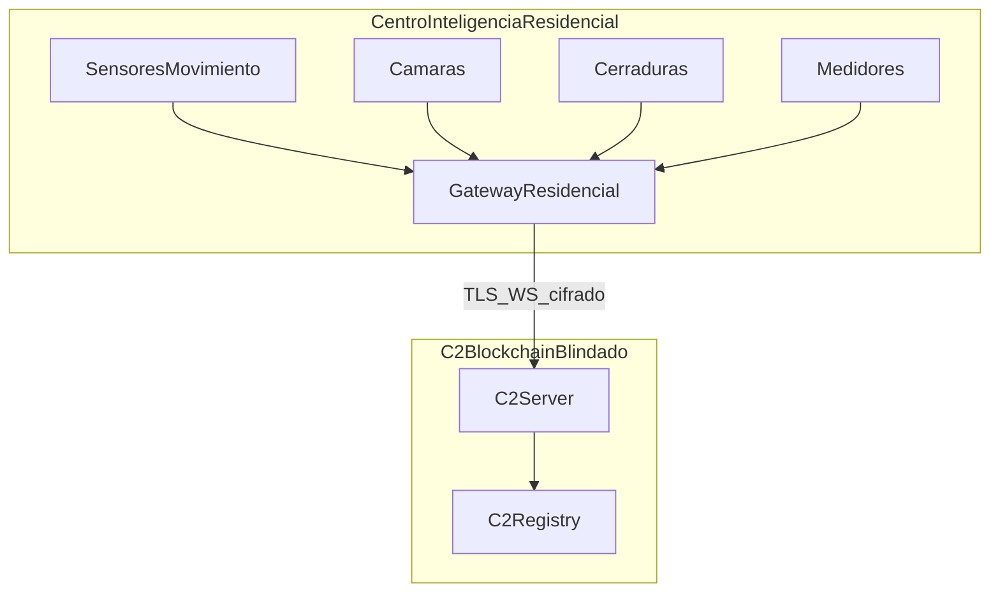
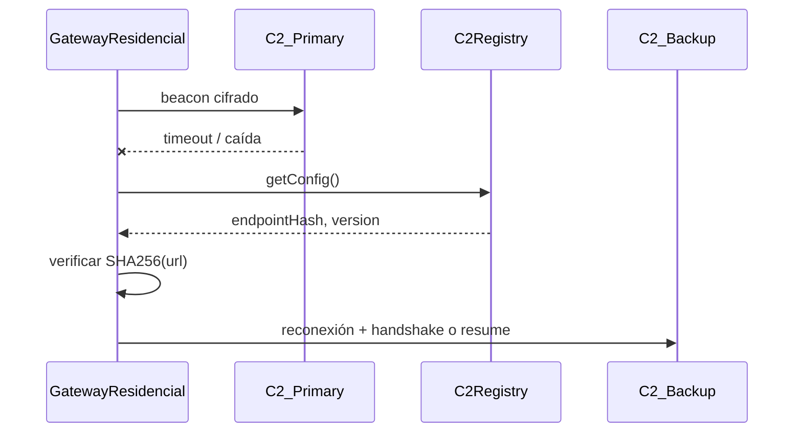

# 07 — Fusión IoT Residencial + C2 Blockchain-Blindado

## Resumen

Este documento define cómo **blindar la conexión entre dispositivos IoT** del **Centro de Inteligencia Residencial** usando la arquitectura del **Sistema C2 Blockchain-Blindado** como motor de seguridad y coordinación.

| Proyecto | Rol en la fusión |
|----------|------------------|
| **Centro de Inteligencia Residencial** (contexto institucional / PDF) | Define **qué** problema resolver: usuarios, comunidad, servicios residenciales, dispositivos del hogar |
| **C2 Blockchain-Blindado** (SDD técnico) | Define **cómo** blindar la solución: cifrado, coordinación blockchain, failover, pruebas, demo Aligo |

La fusión se logra en **tres capas superpuestas**:

```text
┌─────────────────────────────────────────────────────────┐
│  Capa aplicación — Centro de Inteligencia Residencial │
│  (sensores, cámaras, cerraduras, medidores, comunidad)│
├─────────────────────────────────────────────────────────┤
│  Capa seguridad — C2 SDD (AES-GCM, ECDH, handshake)    │
├─────────────────────────────────────────────────────────┤
│  Capa confianza — C2Registry en Polygon Amoy            │
└─────────────────────────────────────────────────────────┘
```

## Confirmaciones del reto (retroalimentación Aligo)

| Pregunta / tema | Respuesta retadores | Decisión de diseño |
|-----------------|---------------------|-------------------|
| ¿Modelar gateway? | **Sí** | Gateway = agente C2 con `agent_role=iot_gateway` |
| ¿Sensores físicos obligatorios? | **No** — se pueden **simular** | Scripts/procesos en VM generan `iot_event` |
| ¿Comandos a cerraduras? | **Sí** | `iot_command` lock/unlock/status en cerradura simulada |
| ¿Copiar C2 existente? | **No recomendado** — buscan **innovación** | C2 core propio + blockchain + camuflaje + escenario residencial |
| ¿Realismo / no ser detectados? | Operación **realista** en lab | Camuflaje de canal, jitter, metadata on-chain — [05_security_specs.md](./05_security_specs.md) |
| ¿Blockchain? | **Sí** — diferenciador | Registry, identidades, config sin URLs en claro |

---

## Paso 1 — Definir la capa IoT (Start Here)

### Dispositivos residenciales objetivo

| Categoría | Dispositivos | Rol en el ecosistema |
|-----------|--------------|----------------------|
| Seguridad | Sensores de movimiento, cámaras, cerraduras inteligentes | Eventos de alerta y comandos de apertura/cierre |
| Utilidades | Medidores de energía y agua | Telemetría periódica (lecturas, consumo) |
| Agregación | Gateways residenciales | Agrupan tráfico IoT, ejecutan handshake hacia C2 Server |

### Mapeo IoT → componentes C2

En el SDD, cada dispositivo IoT o gateway se modela como un **agente C2** (`cmd/agent` o variante `cmd/iot-agent`):

| IoT | Equivalente C2 | Notas |
|-----|----------------|-------|
| Gateway residencial | Agente principal | Un gateway por hogar o bloque; beacon y sesión |
| Sensor / cámara / cerradura | Evento o comando vía gateway | Sensores **simulados**; cerraduras con lock/unlock **simulado** |
| Medidor energía/agua | Telemetría vía gateway | Beacon con lecturas en envelope cifrado |
| Operador residencial / admin | Operator Console | API REST + JWT; tareas `iot_command` hacia cerraduras |

### Simulación de sensores (sin hardware)

| Simulador | Genera | Frecuencia |
|-----------|--------|------------|
| `sensor_motion` | `iot_event` motion=true, zone | Aleatoria 10–60s |
| `meter_energy` | `iot_telemetry` kwh | Cada beacon o 60s |
| `smart_lock` | Estado `locked`/`unlocked` | Responde a `iot_command` |

Ubicación futura: `scripts/sim/` o `internal/sim/` (Fase 2).

### Comandos a cerraduras (confirmado)

Flujo: Operador → `POST /tasks` (`iot_command`) → gateway → simulador `smart_lock` → `task_result` cifrado → operador.

| `action` | Efecto simulado |
|----------|-----------------|
| `lock` | Estado `locked` |
| `unlock` | Estado `unlocked`; opcional `duration_sec` → auto-relock |
| `status` | Retorna `locked` o `unlocked` sin cambio |

### Topología residencial



---

## Paso 2 — Integrar cifrado extremo a extremo (Recommended)

Aplicar los algoritmos definidos en [05_security_specs.md](./05_security_specs.md) y el envelope de [03_api_design.md](./03_api_design.md).

### Flujo por dispositivo

1. **Generación de claves**: cada gateway (y opcionalmente cada dispositivo crítico) genera par ECDSA secp256k1 + ECDH P-256 en arranque.
2. **Handshake vía gateway**: `POST /agents/handshake` (challenge ECDSA + derivación de clave de sesión HKDF).
3. **Transmisión**: telemetría y eventos en envelope `AES-256-GCM` sobre WebSocket o REST beacon.
4. **Autenticación y confidencialidad**: firma en headers (`X-Signature`, `X-Timestamp`, `X-Nonce`); GCM auth tag en payload.

### Tipos de mensaje IoT (plaintext antes de cifrar)

```json
{
  "type": "iot_event",
  "device_id": "sensor-motion-01",
  "device_type": "motion_sensor",
  "timestamp": 1719000000,
  "payload": { "motion": true, "zone": "entrada" }
}
```

```json
{
  "type": "iot_telemetry",
  "device_id": "meter-energy-01",
  "device_type": "energy_meter",
  "timestamp": 1719000030,
  "payload": { "kwh": 12.4, "unit": "kWh" }
}
```

### Comandos hacia IoT (operador → gateway → dispositivo)

```json
{
  "type": "task",
  "task_id": "uuid",
  "command_type": "iot_command",
  "payload": {
    "target_device": "lock-main",
    "action": "unlock",
    "duration_sec": 5
  }
}
```

---

## Paso 3 — Coordinar con blockchain (Trust Layer)

La blockchain **no transporta lecturas de sensores ni video**. Funciona como **registro de confianza y coordinación** (ver [02_system_architecture.md](./02_system_architecture.md)).

### Registro de identidades IoT en `C2Registry`

Extensión conceptual del contrato (Fase 2):

| On-chain | Off-chain |
|----------|-----------|
| `bytes32 devicePubKeyHash` | Clave pública ECDSA del gateway/dispositivo |
| `bytes32 gatewayHash` | Hash del ID de gateway residencial |
| Evento `DeviceRegistered` | Metadata en SQLite `agents` + `device_type` |

Funciones adicionales propuestas:

- `registerDevice(bytes32 pubKeyHash, bytes32 gatewayHash)` — solo operador activo
- `revokeDevice(bytes32 pubKeyHash)` — revocación de dispositivo comprometido

### Validación de integridad

- **Config**: `getConfig()` provee `endpointHash` y `beaconIntervalSec` para todos los gateways del conjunto residencial.
- **Eventos**: `ConfigUpdated` y `DeviceRegistered` indexados por ChainIndexer → cache en `chain_config_cache` y audit.
- **Red**: Polygon Amoy (`chainId: 80002`) — baja latencia y costo en testnet para demo hackathon.

---

## Paso 4 — Implementar arquitectura de failover (Resiliencia)

| Mecanismo | Uso en IoT residencial |
|-----------|------------------------|
| **Gateways alternativos** | Segundo gateway en el mismo hogar o nodo vecino; mapa local `hash → URL` |
| **Redis** | `session:{gateway_id}`, `beacon:pending:{gateway_id}`, cache de claves de sesión |
| **Beaconing** | Intervalo desde `beaconIntervalSec` on-chain; caída detectada si `2 × interval` sin beacon |
| **Failover on-chain** | Tras timeout, gateway lee `getConfig()` y reconecta a endpoint backup verificado |



---

## Paso 5 — Fusionar proyectos (Integration)

### Roadmap unificado

| Fase | Entregable | Dependencia |
|------|------------|-------------|
| **R1 — IoT** | Inventario dispositivos, gateway como agente, eventos simulados en lab | Paso 1 |
| **R2 — Cifrado** | Handshake + envelope en gateway; tests CRYPTO/HS | Paso 2, Fase 2 TDD |
| **R3 — Blockchain** | `C2Registry` + registro gateway; lectura `getConfig()` | Paso 3 |
| **R4 — Failover** | Demo caída servidor + reconexión gateway | Paso 4 |
| **R5 — Demo Aligo** | Video 3–7 min: hogar simulado → evento sensor → operador → blockchain | Entregables reto |

### Plataformas y frameworks (reto Aligo)

- Agentes y gateways en lab: **Linux** o **Windows** (VMs autorizadas).
- **Metasploit** permitido como complemento (`msf_module`); el **C2 core** (server, protocolo, agente, blockchain) es desarrollo propio — ver [01_project_overview.md](./01_project_overview.md).

### Narrativa para jurado / ficha de entrega

1. **Problema residencial**: hogar inteligente necesita dispositivos conectados con trazabilidad y resistencia a fallos de red.
2. **Solución**: C2 Blockchain-Blindado como **plataforma de control seguro** bajo el Centro de Inteligencia Residencial.
3. **Innovación (35%)**: blockchain + IoT + C2 en un solo ecosistema verificable.
4. **Funcionalidad (25%)**: gateway conectado, comando remoto (ej. consultar medidor o simular alerta), resultado al operador.
5. **Demo**: laboratorio con gateway VM + sensores simulados, no despliegue en hogares reales sin autorización.

### Límites de la fusión (non-goals IoT)

- No streaming de video en blockchain
- No despliegue en infraestructura residencial real sin consentimiento y red aislada
- MVP: 1 gateway + 2–3 dispositivos simulados suficiente para hackathon

---

## Trazabilidad documental

| Tema | Documento |
|------|-----------|
| Visión y reto Aligo | [01_project_overview.md](./01_project_overview.md) |
| Arquitectura y failover | [02_system_architecture.md](./02_system_architecture.md) |
| API y envelopes IoT | [03_api_design.md](./03_api_design.md) |
| Modelos gateway/dispositivo | [04_data_models.md](./04_data_models.md) |
| Criptografía E2E | [05_security_specs.md](./05_security_specs.md) |
| Tests y demo IoT | [06_testing_strategy.md](./06_testing_strategy.md) |

## Referencias cruzadas

- Índice SDD: [README.md](./README.md)
